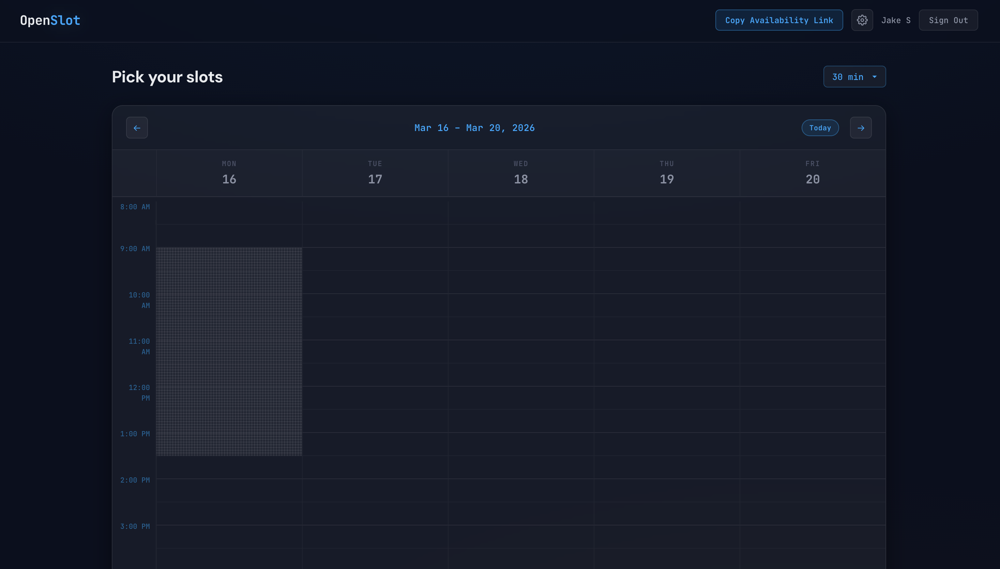
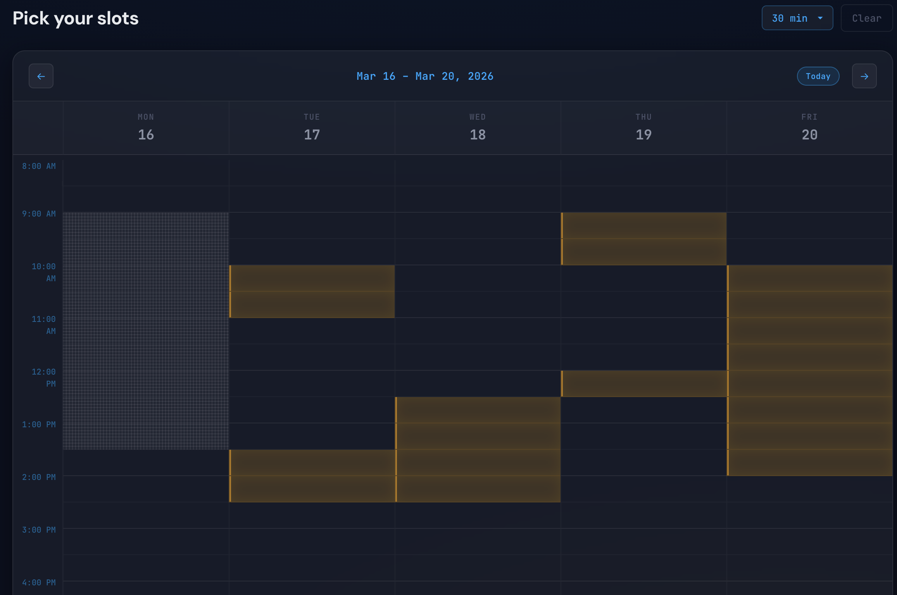
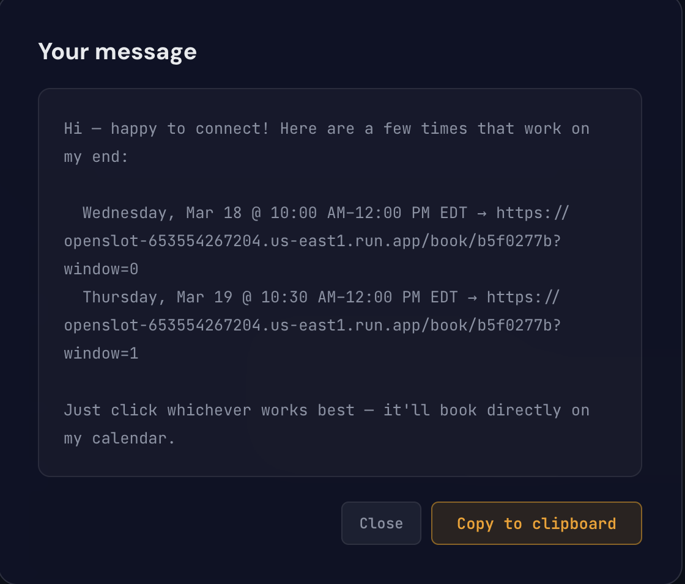
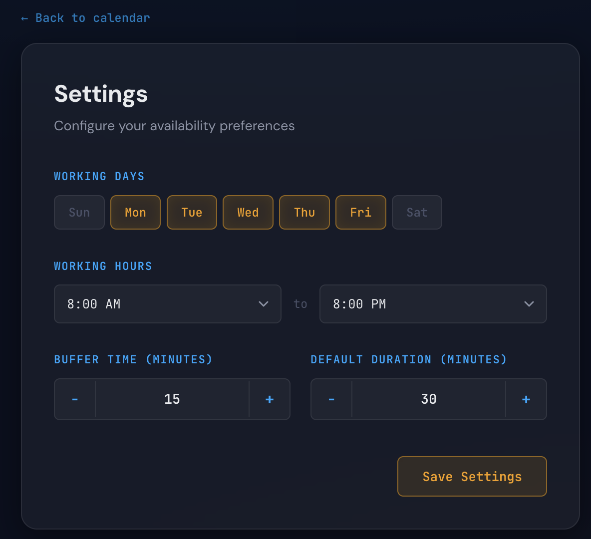
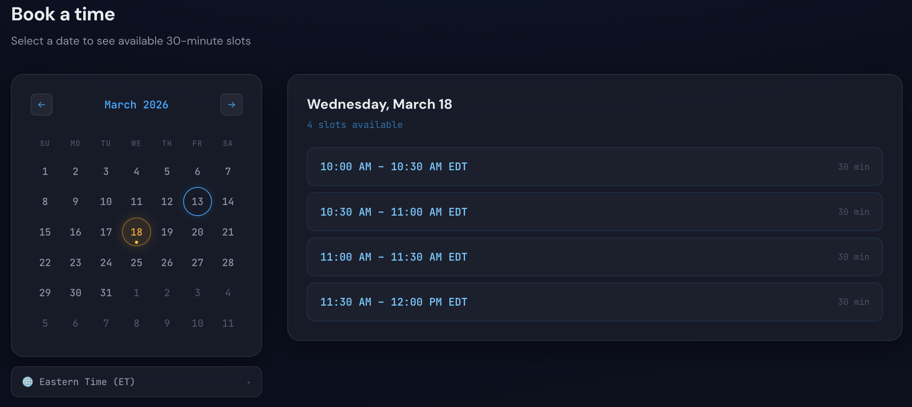
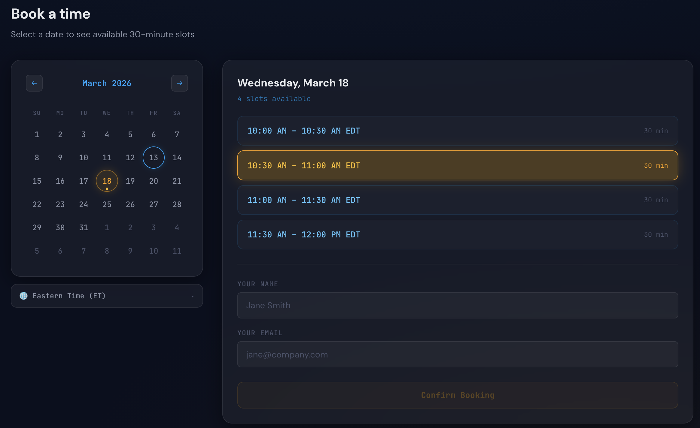

# OpenSlot

A self-hosted scheduling app that connects to your calendar (Google supported to start). Select available times, share a link, and let others book directly onto your calendar — eliminating fees for any third-party services.

Built on Google Cloud with Node.js and React. MIT licensed.

## Screenshots












## Features

- **Drag-to-select availability** on a week grid showing your real calendar feed
- **Two ways to share**: copy a full-availability link, or drag specific windows and generate a personal message with per-window booking links
- **Real-time conflict check** at booking time — no stale slots
- **Google Meet links** added to every booking automatically
- **Timezone support** — recipients can view times in their local timezone with a searchable dropdown
- **Configurable** working days, hours, buffer time, and meeting duration via a settings page
- **Self-service rescheduling** — every calendar invite includes a reschedule link; recipients can move their booking without bothering the host
- **No account required** for recipients — they just pick a time & confirm
- **Rate limiting** on the booking endpoint to prevent abuse
- **Mobile-friendly** booking page
- **PWA installable** — add to home screen on iOS/Android for a full-screen app experience

## Architecture

The codebase is organized for clarity and maintainability:

- **Backend route files** (`backend/src/routes/`) handle Express endpoints for availability, offers, calendar, settings, and auth
- **Shared helpers** (`backend/src/helpers/calendar.js`) centralize Google Calendar authentication, event filtering, conflict checking, and slot math — used by all route files
- **Frontend components** (`frontend/src/components/`) include `WeekGrid` (owner drag-to-select), `PublicBooking` (recipient booking flow), and `Settings` (configurable working hours/days)
- **CSS design system** in `App.css` uses custom properties (`--accent`, `--amber`, `--error`, etc.) for consistent theming

## Prerequisites

- A **Google account** (the calendar you want to schedule against)
- A **GCP project** with billing enabled (free tier is sufficient)
- **Node.js 22** or later
- This repo cloned locally

## GCP Setup

### 1. Create a GCP project

Go to [console.cloud.google.com](https://console.cloud.google.com) and create a new project. Name it whatever you like.

### 2. Enable APIs

In your GCP project, go to **APIs & Services > Library** and enable:

- **Google Calendar API**
- **Gmail API**

### 3. Configure OAuth consent screen

Go to **APIs & Services > OAuth consent screen**:

1. Select **External** user type
2. Fill in the app name (e.g. "OpenSlot") and your email for support contact
3. On the **Scopes** step, add these scopes:
   - `https://www.googleapis.com/auth/calendar.readonly`
   - `https://www.googleapis.com/auth/calendar.events`
   - `https://www.googleapis.com/auth/userinfo.email`
   - `https://www.googleapis.com/auth/userinfo.profile`
   - `https://www.googleapis.com/auth/gmail.send`
4. On the **Test users** step, add your Google email address (while the app is in "Testing" status, only listed test users can sign in)

### 4. Create OAuth credentials

Go to **APIs & Services > Credentials**:

1. Click **Create Credentials > OAuth client ID**
2. Application type: **Web application**
3. Authorized redirect URIs: add `http://localhost:3001/auth/callback`
4. Copy the **Client ID** and **Client Secret** — you'll need them for `.env`

## Environment Variables

Copy `.env.example` to `.env` at the repo root and fill in the values:

| Variable | Description | Where to find it |
|---|---|---|
| `GOOGLE_CLIENT_ID` | OAuth client ID | GCP Console > APIs & Services > Credentials |
| `GOOGLE_CLIENT_SECRET` | OAuth client secret | Same page as client ID |
| `GOOGLE_REDIRECT_URI` | OAuth callback URL | Set to `http://localhost:3001/auth/callback` for local dev |
| `GOOGLE_CALENDAR_ID` | Which calendar to use | `primary` uses your main calendar (default) |
| `SESSION_SECRET` | Random string for cookie signing | Generate any random string |
| `FRONTEND_URL` | Frontend origin for CORS | `http://localhost:3000` for local dev |
| `PORT` | Backend server port | Set to `3001` for local dev (frontend proxy expects 3001) |
| `NODE_ENV` | Environment mode | `development` for local dev |

## Local Development

```bash
# Clone the repo
git clone https://github.com/jakeshaver/openslot.git
cd openslot

# Create your .env file at the repo root
cp .env.example .env
# Edit .env and fill in your Google OAuth credentials

# Install backend dependencies
cd backend
npm install

# Install frontend dependencies
cd ../frontend
npm install

# Start the backend (from backend/ directory)
cd ../backend
node src/index.js
# Backend runs on http://localhost:3001

# In a separate terminal, start the frontend (from frontend/ directory)
cd frontend
npm start
# Frontend runs on http://localhost:3000
```

Open [http://localhost:3000](http://localhost:3000) and sign in with Google. The frontend proxies API requests to the backend via the CRA proxy configuration.

## How It Works

OpenSlot has two offer types:
- **Full Availability** is a one-click button that copies a booking URL covering all your available slots across the next 7 working days (based on your configured schedule).
- **Curated Offers** let you drag specific time windows on the week grid and generate a personal message with one booking link per window — designed to paste into an email or DM.

Both offer types are single-use. When a recipient opens a booking link, they see available time slots with a real-time conflict check against your current calendar. They pick a time, enter their name and email, and a calendar event is created for both of you with a Google Meet link attached.

## License

MIT — see [LICENSE](LICENSE).
